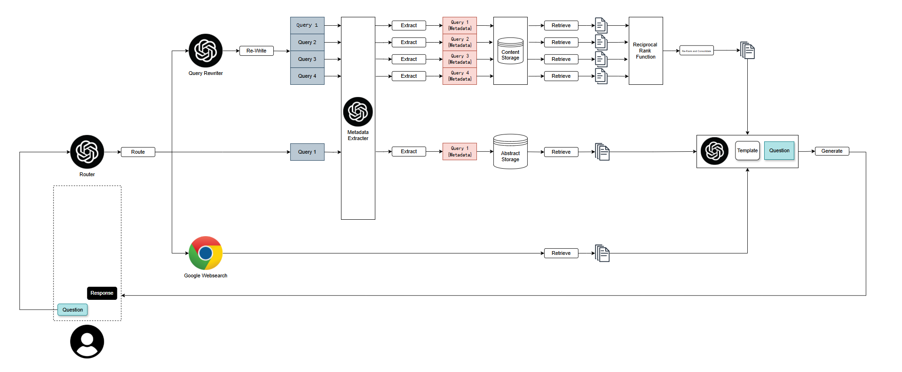

# ClimaRAG

*A Retrieval-Augmented Generation (RAG) based Question-Answering System*  
[🇨🇳 中文版 (Chinese Version)](assets/docs/README_CN.md)



---

## 🧠 Project Overview

**ClimaRAG** ClimaRAG is a retrieval-augmented generation (RAG) system designed to support academic research on climate change.
It retrieves relevant documents from a vector database based on user queries and generates concise summaries or analytical answers.
When a query extends beyond the database’s scope, the system automatically performs a Google Search and integrates the results with a large language model (LLM) to produce a comprehensive response.

---

## 📁 Data

For detailed information about the dataset and processing workflow, see the  
👉 [Full Data Description](assets/docs/data_description.md)

## ⚙️ System Requirements

- **Python ≥ 3.9** (Python 3.9 recommended; `requirements.txt` and `setup.py` tested on 3.9)
- **Node.js** (required for the frontend)
- **VPN access** required in some regions (eg. Mainland China)

### 🌐 VPN Requirement

This RAG system connects to:
- **Hugging Face** (for downloading models)
- **OpenAI API**
- **Google Search API**

If you are located in mainland China, a **VPN** is required.

---

## 🚀 Installation

### 1️⃣ Clone the repository

```bash
git clone [repository URL]
```

### 2️⃣ Install backend dependencies

```bash
cd RagSummarizer
# Recommended: use a virtual environment
# Example: conda create -n rag python=3.9 && conda activate rag
pip install -r requirements.txt
```

Or install directly via `setup.py`:

```bash
pip install .          # Standard install
# OR
pip install -e .       # Editable install (for development)
```

### 3️⃣ Install frontend dependencies

```bash
cd frontend
npm install
```

---

## 🧩 Core Dependencies

- **FastAPI** — Web framework  
- **LangChain** — Core RAG framework  
- **LangGraph** — Conversation memory management  
- **ChromaDB** — Vector database  
- **Sentence-Transformers** — Text embeddings  

**Additional components:**
- `langchain-chroma`
- `langchain-community`
- `langchain-core`
- `langchain-huggingface`
- `python-dotenv` — Environment configuration  
- `uvicorn` — ASGI server  

---

## 🛠️ Usage

### 1️⃣ Configure environment variables

```bash
cd src
cp .env.example .env
# Rename .env.example to .env
# Then edit the .env file to include your API keys and proxy (if needed)
```

### 2️⃣ Start the backend service

```bash
# From the RagSummarizer root directory
python -m src.app
```

### 3️⃣ Start the frontend

```bash
cd frontend
npm run dev
```

### 4️⃣ Access the frontend

Open in your browser:  
👉 [http://localhost:3000/](http://localhost:3000/) (default port 3000)

---

## ⚙️ Configuration

You can modify system and prompt settings in:

- `src/configs/settings.py`
- `src/configs/prompt_settings.py`

---

## ❓ FAQ

### 1. Do I need a VPN to run this project?

Yes.  
A VPN is required to access **Hugging Face**, **OpenAI API**, and **Google Search API**.

---

### 2. When should I modify `HTTP_PROXY` and `HTTPS_PROXY` in the `.env` file?

- If your VPN setup **requires a proxy**, update `HTTP_PROXY` and `HTTPS_PROXY` accordingly.  
- If your VPN **does not** require a proxy, leave them **empty**.

---

### 3. I encountered a "Remote Error" when calling the API. What does this mean?

This typically indicates an **unstable VPN connection**.  
Please check your VPN connection or try another VPN provider.

---

### 4. I only want to use the database RAG and not Google Search. What should I do?

Set the following in your `.env` file:
```
WEB_SEARCH_ENABLED=false
```
This disables Google Search and keeps the local database RAG active.

---

## 🧱 Project Structure

```
python/                         # Development and testing scripts
frontend/                       # Frontend source code
src/
├── api/                        # API endpoints
├── services/                   # Core service layer
├── models/                     # Data models
├── config/                     # Configuration files
├── custom_imported_classes/    # Custom LangChain class overrides
├── custom_classes/             # Custom LLM classes
├── utils/                      # Utility functions
├── data/                       # Source documents (converted to vector embeddings on first run)
├── tests/                      # Tests (for development only)
├── chroma_db/                  # Vector database storage
├── app.py                      # FastAPI application entry point
├── main.py                     # Development entry point (not for production)
└── .env.example                # Example environment configuration
setup.py                        # Package setup (for pip install .)
pyproject.toml                  # Build configuration (for pip install -e .)
requirements.txt                # Dependency list (for pip install -r requirements.txt)
```

---

## 🧩 Development Status

**Current Version:** `0.1.0 (Alpha)`

- last maintained on **20 Dec 2025**
- The project is under **active development**.  
- **API interfaces may change** in future updates.

---

## 🤝 Contributing

Contributions are welcome!  
Feel free to:
- Open **Issues** for bugs or feature requests  
- Submit **Pull Requests** for improvements  

---

## ⚠️ Notes

- This project is in **Alpha** — **not recommended for production** use.  
- Make sure all **API keys** are properly configured before running.  
- It is **highly recommended** to use a **virtual environment** for installation and development.

---

## 🏷️ License

This project is released under the **MIT License**.  
See the `LICENSE` file for details.

---

## 📬 Contact

For questions, suggestions, or collaboration opportunities, please open an issue or contact the maintainer @ hengzkit@gmail.com.

---

*RAG-Summarizer — Retrieval meets Generation for smarter answers.*
